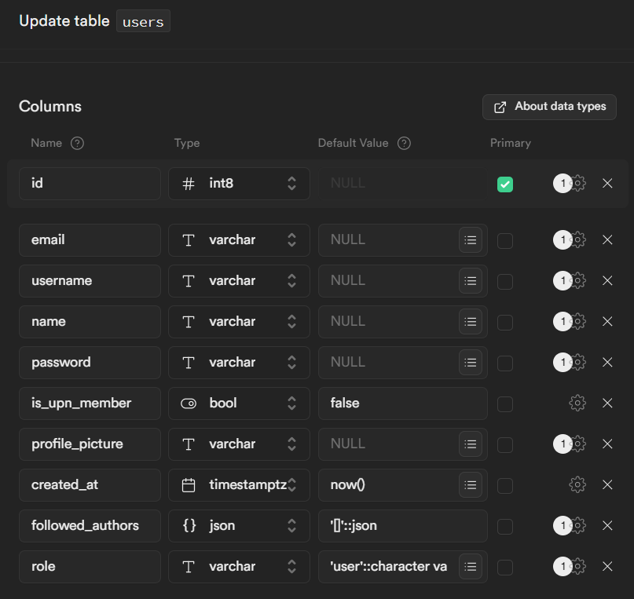
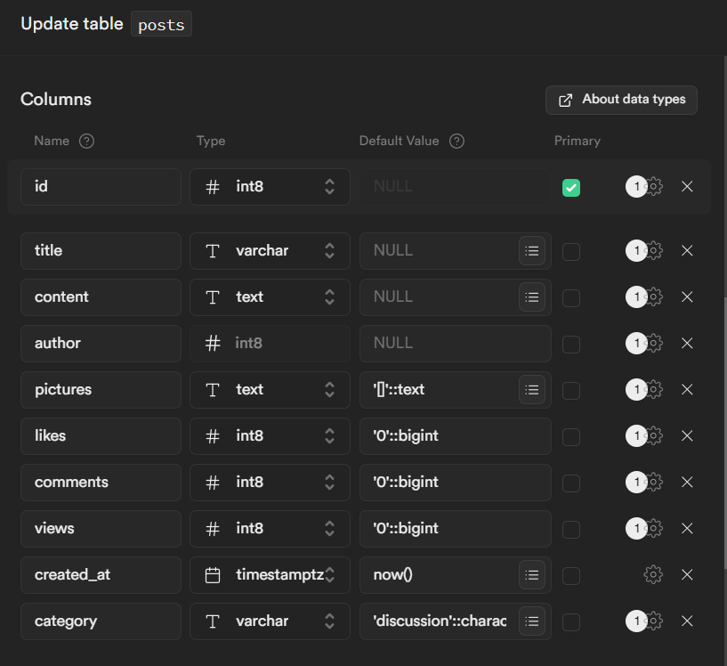
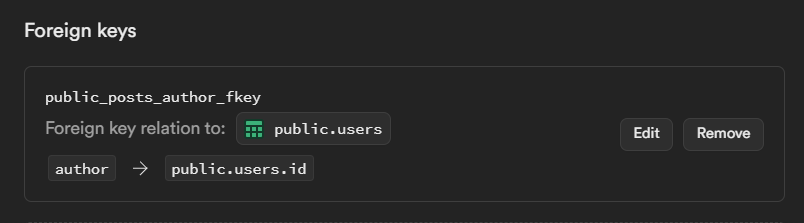
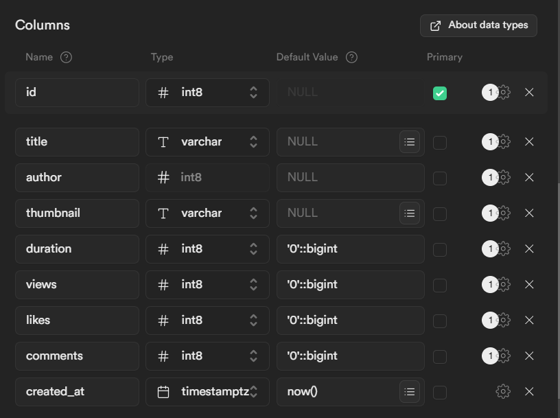
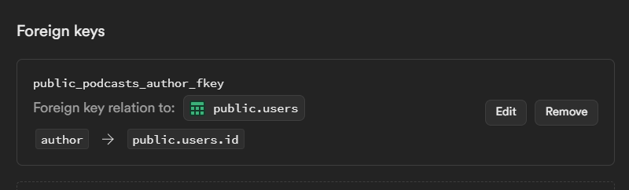
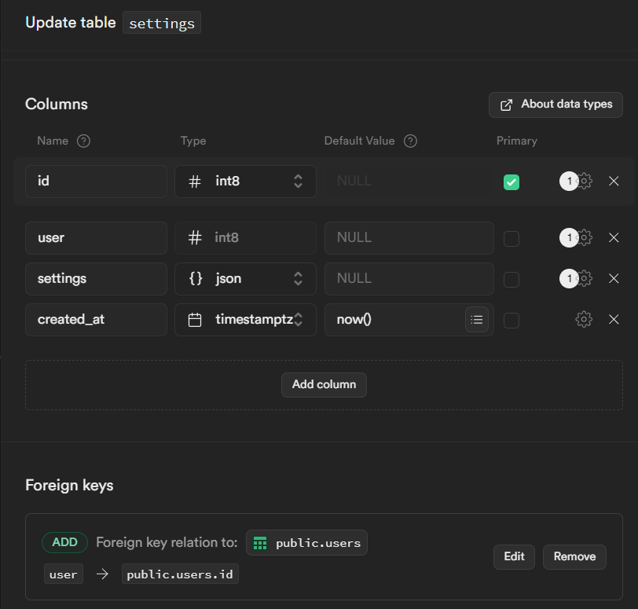

# Table 1 - Users

- username berisi NIM, dan kosong bagi user di luar mahasiswa UPN
- profile_picture berisi url foto profil
- followed_authors berisi ID dari author yang difollow, disimpan dalam JSON
 - role, user, user admin dan it admin.

# Table 2 - Posts

Table untuk news dan discussion, sekaligus. Jika news, maka kolom kategori akan berisi news, jika discussion, maka kolom kategori akan berisi discussion, secara default diisi discussoin.

- kolom author adalah foreign key ke kolom id pada table users.
- kolom pictures berisi array yang memuat url-url gambar pada post, disimpan dalam bentuk JSON.
- kolom likes, views, dan comments berisi jumlah.

# Table 3 - Podcasts

Table untuk podcast, id akan digunakan sebagai pemetaan audio di server.
- author berisi ID dari user yang mengupload podcast, foreign key ke tabel users.id
- thumbnail berisi link ke gambar thumbnail
- duration berisi panjang podcast dalam satuan detik
- views likes dan comments berisi jumlah

# Table 4 - Settings

Settings, berisi isi page pengaturan dari masing-masing user, sehingga apabila user login pada device berbeda pengaturannya tetap sama.
Kolom settings berisi JSON yang tidak memiliki skema khusus, jadi apabila ingin ditambahkan opsi baru tidak perlu ada perubahan pada skema database.